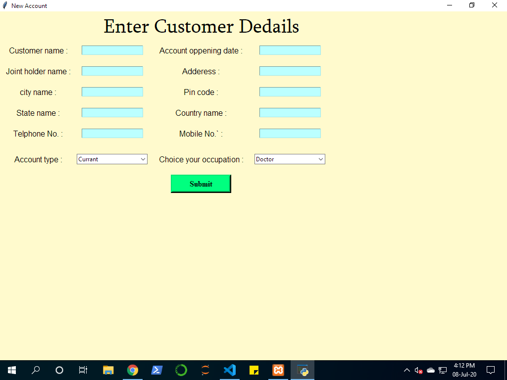
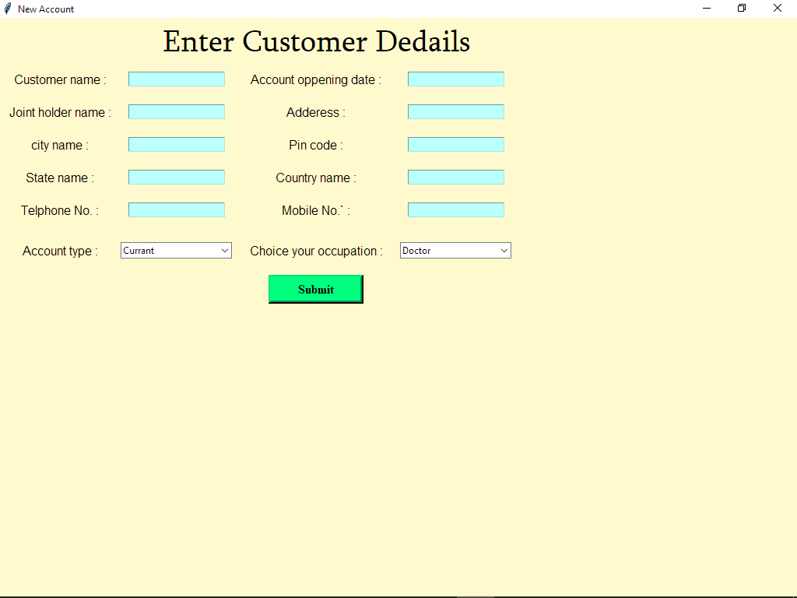

# Banking-management-system
It's take input from Tkingr GUI and all your input data store in the mySql.....

## How to use
Open the [XAMPP](https://www.apachefriends.org/index.html) and run the programe. This application is autometicaly make your storage requirment in the server.
I am aded some featur in this application but not uploaded photo.....

#### some image

